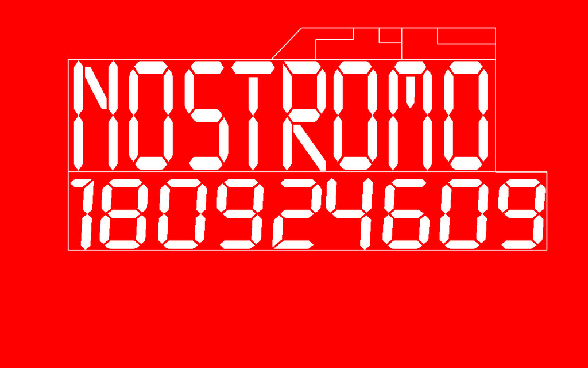
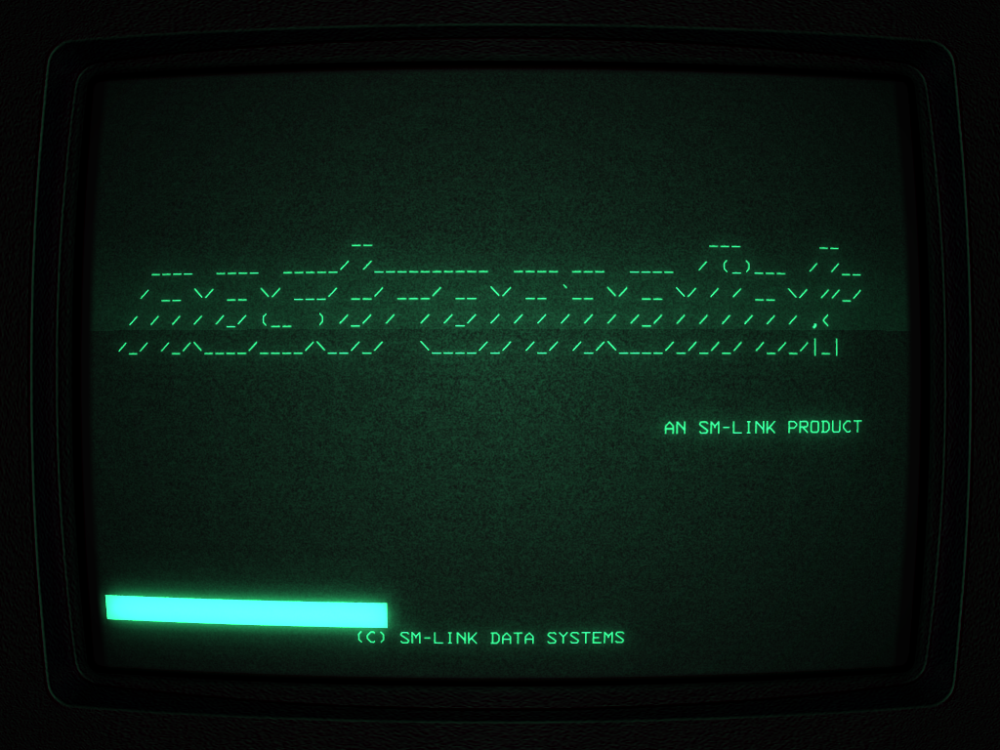
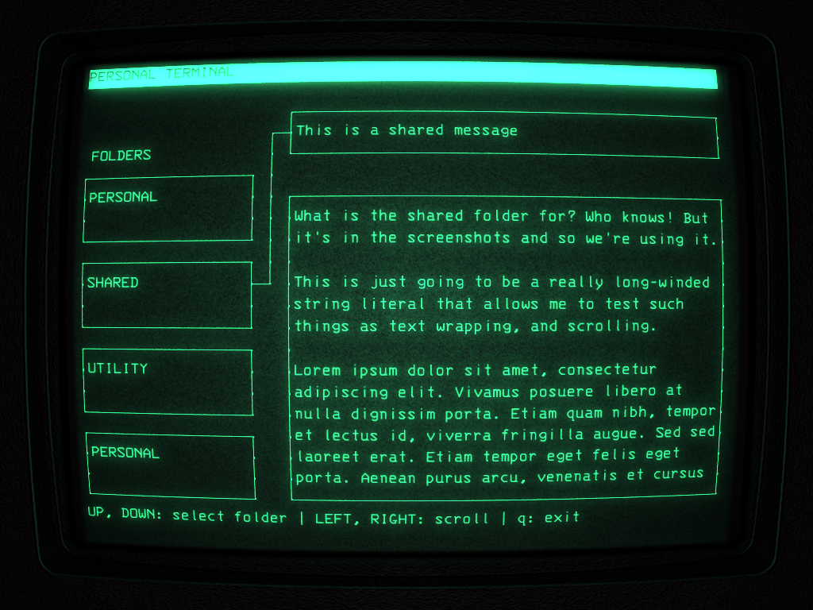

alien-iso
=========

This repository contains scripts which build an *Alien* themed Linux ISO image,
suitable for burning to a flash drive or DVD. The booted operating system has:

- Custom boot splash screen
- Startup noises from the movie
- Spaceship sounds from the movie
- Intermittent monster sounds from *Alien: Isolation*
- Pre-configured, auto-starting "cool-retro-term" which looks like the CRT
  screens found in the movie and game
- A program that emulates the "personal terminal" application found in Alien:
  Isolation

You can find a download of this ISO on [my website][], along with some
screenshots of the different components and a rough overview of how it works.

Build your own
--------------

It should be possible to build yourself, provided that you have a computer
running Arch Linux.

1. You should have `base-devel` and `archiso` installed. Also, you should have
   sudo configured.
2. Run `./mkalieniso`. You will be prompted by sudo for your password.
3. ISO is located in `profile/out`
4. You can clean things up with `sudo rm -rf aur customrepo profile`

Each time you run the script, a full rebuild is triggered (except for building
AUR packages). This is difficult to avoid. Pull requests welcome :)

Customize
---------

This is built on top of [archiso][]. Read that first. Below are a few items you
may want to customize if you were to build this yourself.

### Change username

The current username is `ripley`. You can change it by editing the following
files:

- `master/airootfs/root/customize_airootfs.sh`
- `master/airootfs/var/local/lightdm.conf`
- `master/airootfs/etc/systemd/system/getty@tty1.service.d/autologin.conf`

(A simple `grep -r ripley .` ought to show you any occurrence you may want to
change)

### Change alien-console text

The alien-console currently just shows some lorem-ipsum placeholder stuff. Check
out the [alien-console repo][] for the configuration file format. You can place
a configuration file and its associated text files within
`master/airootfs/etc/alien-console/`. This should take precedence over the
default one installed in `/usr/share/alien-console`.

You can also include any configuration file anywhere in the filesystem, and then
make a bash alias which points to `alien-console path/to/config.conf`.

Dependencies
------------

Check out [alien-console](https://github.com/brenns10/alien-console), which was
made for this.

Screenshots
-----------

[my website]: https://brennan.io/2017/06/14/alien-computer-card/
[custom repo]: https://wiki.archlinux.org/index.php/Pacman/Tips_and_tricks#Custom_local_repository
[archiso]: https://wiki.archlinux.org/index.php/archiso
[alien-console repo]: https://github.com/brenns10/alien-console
